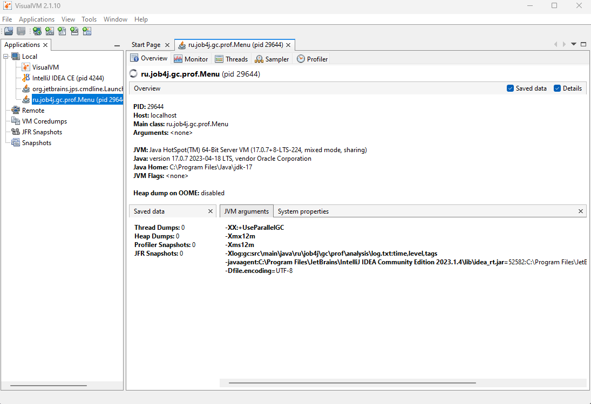
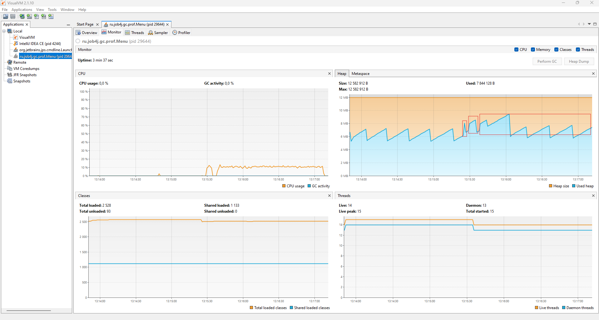
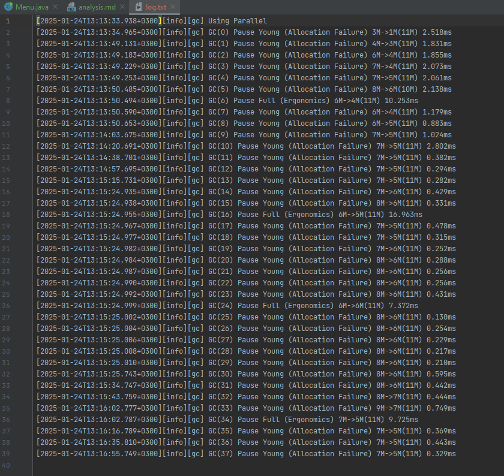
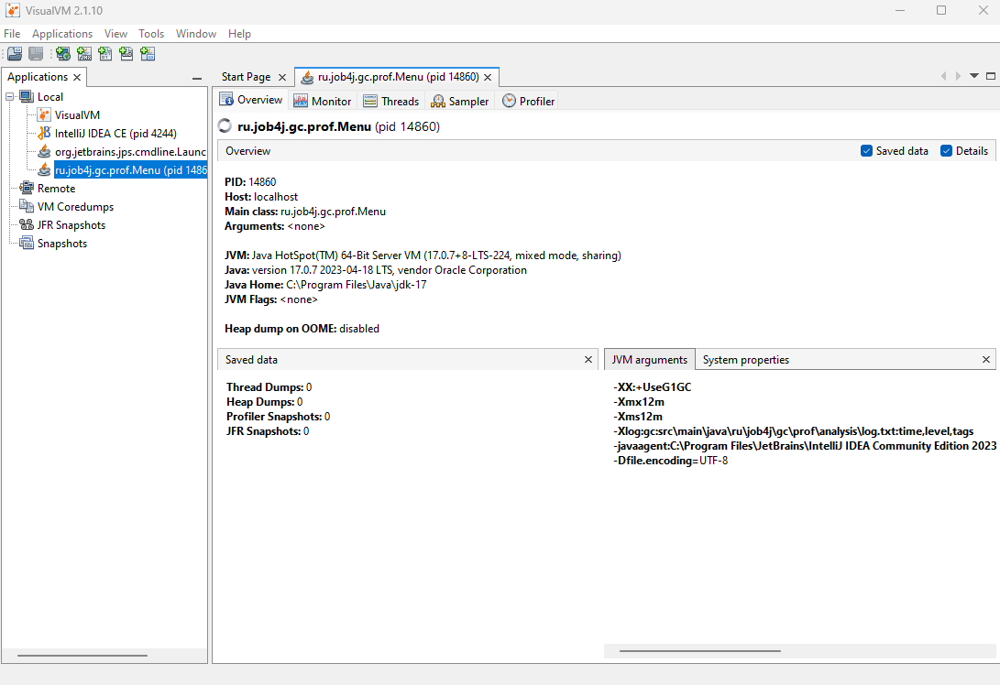
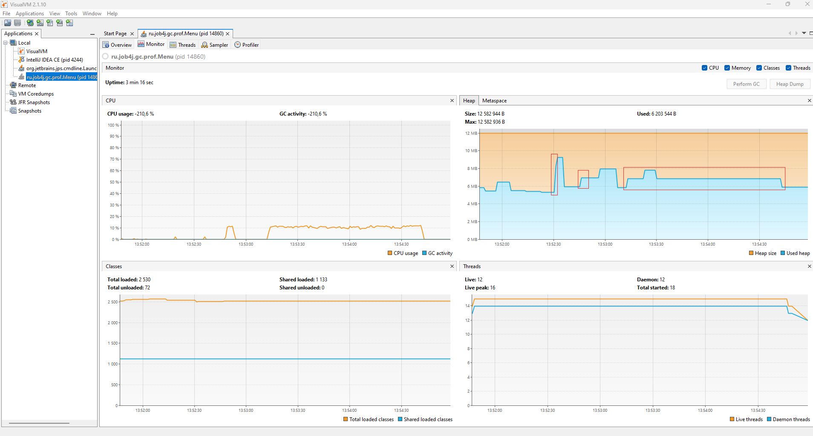
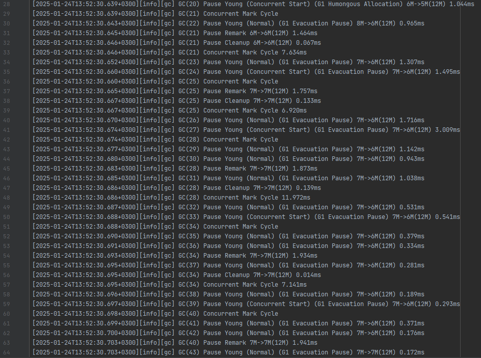
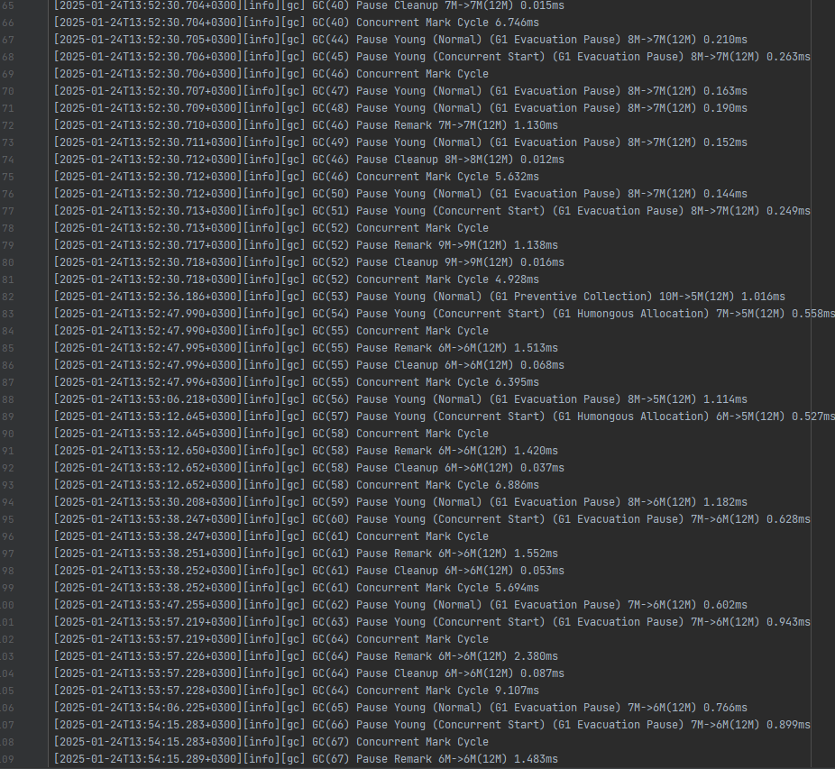
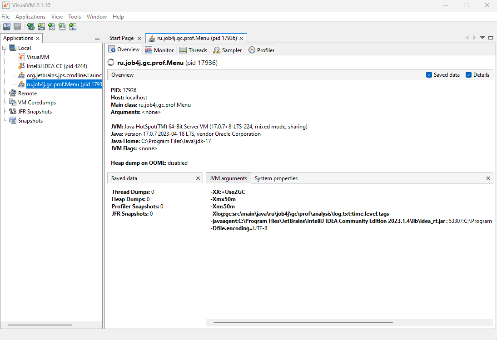
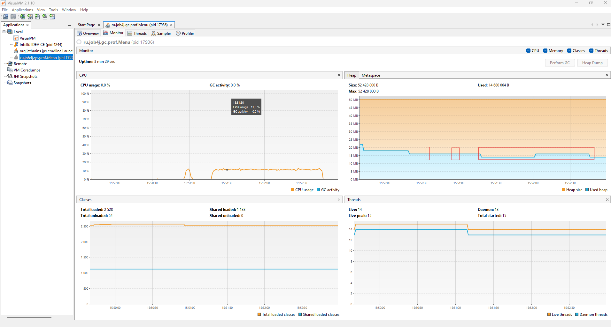
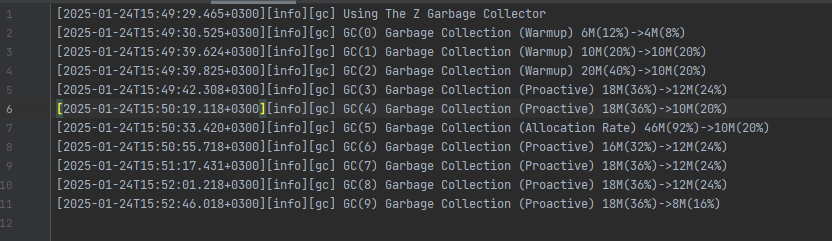

1. Запуск программы с использованием ParallelGC:

  
Сортировка слиянием 13:15:24.93 - 13:15:25.01  
Сортировка вставками 13:15:28.90 - 13:15:33.57  
Сортировка пузырьком 13:15:38.13 - 13:17:07.04  
  

2. Запуск программы с использованием G1:

  
  

Сортировка слиянием 13:52:30.63 - 13:52:30.71  
Сортировка вставками 13:52:47.98 - 13:52:52.67  
Сортировка пузырьком 13:53:12.64 - 13:54:41.88
  
  

3. Запуск программы с использованием ZGC:

  
  

Сортировка слиянием 15:50:33.32 - 15:50:33.37  
Сортировка вставками 15:50:55.66 - 15:51:00.35  
Сортировка пузырьком 15:51:17.39 - 15:52:45.99  
  
При анализе графиков и логов работы программы для сортировки массивов можно сделать следующие выводы:
1. ParallelGC так же как SerialGC создает паузы в работе программы для сборки мусора, но эти паузы короче вследствие распараллеливания процессов сборки.
2. При работе G1GC паузы в работе программы намного меньше, по-сравнению с работой ParallelGC и SerialGC, длинный паузы в работе программы отсутствуют. Это связано с другими алгоримами сборки мусора и многопоточной работой сборщика мусора.
3. При работе ZGC не наблюдается полных сборок мусора и пауз в работе программы, но вследствии особоненностей работы алгоритма ZGC, понадобилось несколько увеличить объем памяти выделяемый под Heap.
